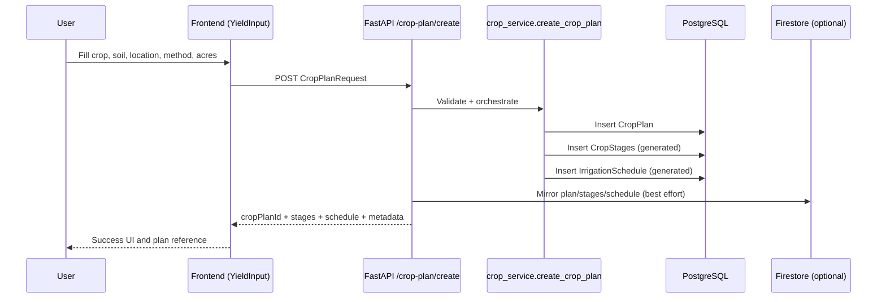
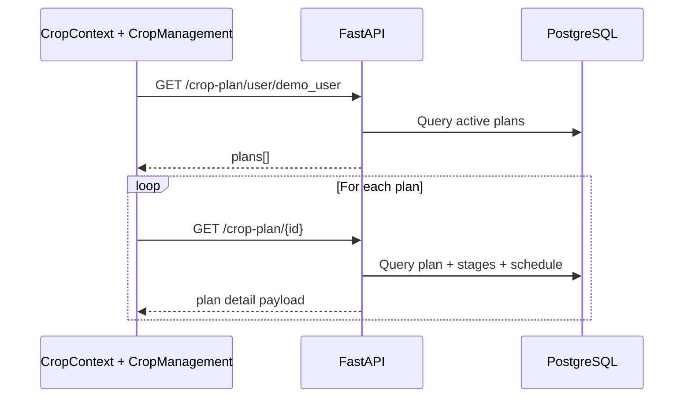
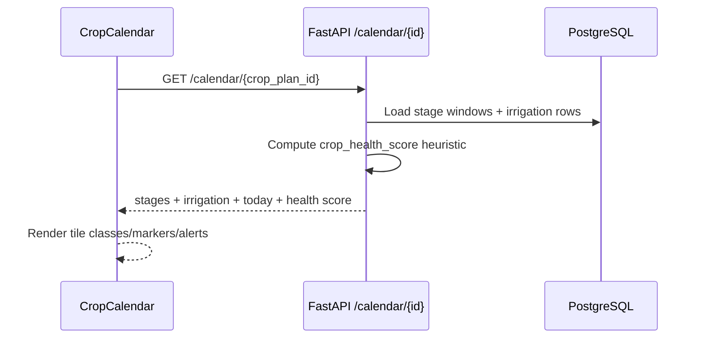
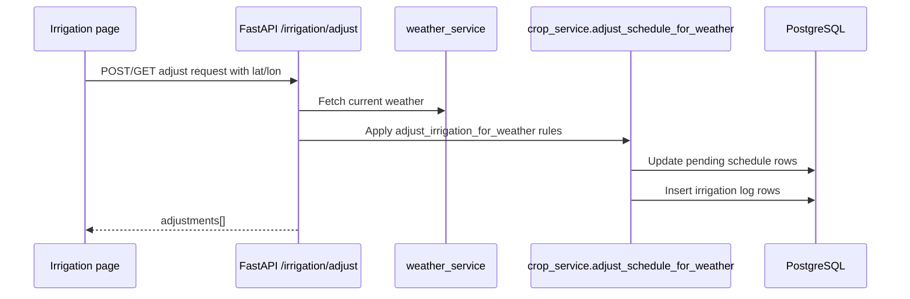
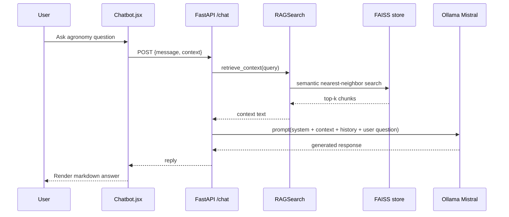
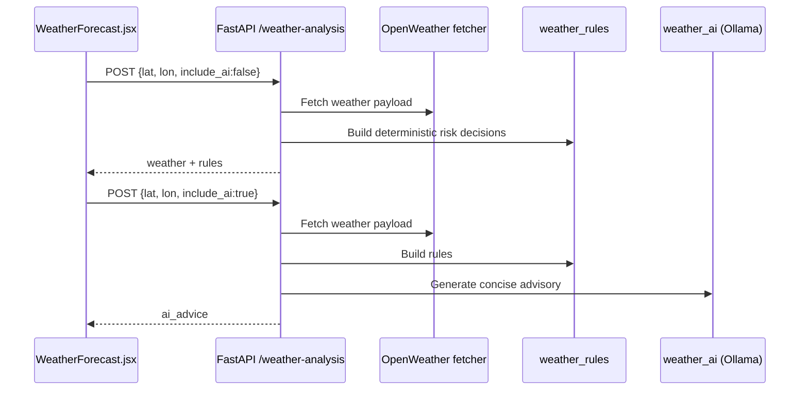

# Smart Farming Assistant — Detailed Architecture, Workflow, and Methodology Analysis

## 1) Purpose and Scope

This document provides a deep technical analysis of the project architecture and end-to-end workflow across:

- Frontend application (React + Router + Context)
- Backend API and domain services (FastAPI + SQLAlchemy)
- RAG and local LLM advisory pipeline (FAISS + sentence embeddings + Ollama)
- Weather intelligence and irrigation decisioning
- Persistence strategy (PostgreSQL primary, Firebase optional mirror)
- Operational methodology, trade-offs, and improvement roadmap

This analysis is based on the current implementation in this repository.

---

## 2) System at a Glance

### Technology Stack

- **Frontend**: React, Vite, React Router, Context API, Lucide icons, React Calendar, React Markdown
- **Backend API**: FastAPI, Pydantic, SQLAlchemy ORM
- **Database**: PostgreSQL (primary)
- **Optional Data Mirror / Real-time Source**: Firebase (Firestore + RTDB)
- **RAG Retrieval Layer**: FAISS + sentence-transformers + LangChain document loaders/splitters
- **Generative Model Runtime**: Ollama (`mistral:latest`)
- **Weather Source**: OpenWeather (OneCall + forecast fallback)
- **Migrations**: Alembic

### Core Product Capabilities

1. Crop plan creation from farmer inputs
2. Stage-wise crop calendar generation
3. Irrigation schedule generation and weather-based adjustment
4. Dashboard and monitoring views
5. Weather intelligence + AI weather advice
6. Chatbot with RAG-enhanced agronomy responses

---

## 3) Module and Layer Map

## 3.1 Frontend Layers

### App Shell and Routing

- `src/main.jsx`: Root render + `CropProvider` bootstrap
- `src/App.jsx`: Route definitions and shell layout (`Navigation`, `Footer`, `main`)

### Shared State Layer

- `src/context/CropContext.jsx`
  - Maintains plan list, selected plan, plan details cache
  - Handles selection persistence (`localStorage`)
  - Provides refresh/load utilities for pages

### Page Layer

- `src/pages/Home.jsx`: entry CTA and feature navigation
- `src/pages/YieldInput.jsx`: crop plan creation form
- `src/pages/CropManagement.jsx`: plan list and quick actions
- `src/pages/CropCalendar.jsx`: stage and irrigation timeline visualization
- `src/pages/Irrigation.jsx`: irrigation operations view + insight block
- `src/pages/WeatherForecast.jsx`: weather/rules/AI weather advice
- `src/pages/Chatbot.jsx`: conversational assistant interface
- `src/pages/Dashboard.jsx`: metrics and status view

### Reusable Component Layer

Examples:

- `src/components/CropCard.jsx`
- `src/components/IrrigationTable.jsx`
- `src/components/IrrigationStatusCard.jsx`
- `src/components/IrrigationLogs.jsx`

### Client Service Utilities

- `src/services/weatherService.js`: direct weather API client (frontend-side key currently hardcoded)
- `src/utils/locationService.js`: geolocation with fallback
- `src/hooks/useIrrigationData.js`: Firebase RTDB subscription hook

---

## 3.2 Backend Layers

### API Composition Layer

- `backend/main.py`
  - Registers routes
  - Composes service calls (crop service, weather, RAG, insights)
  - Adds CORS middleware
  - Hosts chat generation logic

### Schema and Validation Layer

- `backend/schemas.py`: request DTOs for chat, weather, crop-plan creation

### Persistence Layer

- `backend/database.py`: engine/session/base wiring
- `backend/models.py`: domain entities
  - `CropPlan`
  - `CropStage`
  - `IrrigationSchedule`
  - `IrrigationLog`
  - `WeatherLog`

### Service Layer

- `backend/services/crop_service.py`
  - Create/fetch/list/delete plans
  - Serialize entities to API payload shape
  - Apply weather adjustment and persist irrigation logs
- `backend/services/crop_status_engine.py`
  - status, stage, and progress computation

### Domain Engines

- `backend/crop_engine/crop_data.py`: static crop/stage/frequency/water tables
- `backend/crop_engine/crop_planner.py`: stage and schedule generation + weather adjustment rules
- `backend/crop_engine/intelligence.py`: water requirement multipliers
- `backend/irrigation_engine/decision.py`: rolling upcoming schedule generation
- `backend/crop_engine/crop_insights.py`: LLM-based crop-specific insight prompting

### Weather Intelligence Layer

- `backend/weather_engine/weather_service.py`: OpenWeather fetch + normalization
- `backend/weather_engine/weather_rules.py`: deterministic agronomic rule output
- `backend/weather_engine/weather_ai.py`: LLM narrative over weather and rules

### RAG Layer

- `backend/vectorstore/data_loader.py`: ingest PDFs/CSV/TXT/Docx/XLSX/JSON
- `backend/vectorstore/embedding.py`: chunking + embeddings
- `backend/vectorstore/vectorstore.py`: FAISS index and metadata persistence
- `backend/vectorstore/search.py`: retrieval orchestration and context assembly
- `backend/scripts/build_rag.py`: explicit index build
- `backend/scripts/check_index.py`: index integrity check

### Optional Integrations

- `backend/firebase_config.py`: Firestore initialization
- `backend/logging_service.py`: JSON-file based audit logs

---

## 4) Data Model and Relationships

### Entity Relationships

- `CropPlan` (1) -> (N) `CropStage`
- `CropPlan` (1) -> (N) `IrrigationSchedule`
- `CropPlan` (1) -> (N) `IrrigationLog`
- `CropPlan` (1) -> (N) `WeatherLog`

### Data Lifecycle

1. User submits plan input
2. Plan row created in `crop_plans`
3. Stage rows generated into `crop_stages`
4. Irrigation rows generated into `irrigation_schedule`
5. Optional adjustments create entries in `irrigation_logs`
6. Optional mirror persists to Firestore for compatibility

---

## 5) End-to-End Workflow Diagrams

## 5.1 Crop Plan Creation Workflow

## 5.2 Crop Management and Detail Hydration

## 5.3 Calendar Visualization Workflow

## 5.4 Weather-Aware Irrigation Adjustment

## 5.5 Chatbot with RAG + Local LLM

## 5.6 Weather Forecast + Rule + AI Narrative

---

## 6) Methodology and Design Patterns

## 6.1 Architectural Methodology

The project follows a **hybrid pragmatic architecture**:

- **Feature-driven frontend** (pages + focused components)
- **Layered backend** (API -> service -> domain engine -> persistence)
- **Deterministic + Generative AI blend**
  - deterministic rule engines for critical decisions (irrigation/weather risk)
  - LLM for advisory language and context-rich guidance
- **Fallback-oriented integrations**
  - PostgreSQL as source of truth
  - Firebase as optional compatibility mirror
  - weather endpoint with OneCall primary and forecast fallback

## 6.2 Domain Methodology (Agronomy Logic)

- Crop growth is modeled as stage windows with explicit durations.
- Irrigation schedule is produced from stage-level frequency + water requirement heuristics.
- Weather-based adjustments are computed via explainable multipliers and threshold rules.
- Crop status is computed from temporal progress against sowing date and stage windows.

This is a **rule-first agronomy methodology** with optional AI narrative overlay.

## 6.3 AI Methodology

- Chat uses **RAG retrieval augmentation** to ground generation.
- Prompting style constrains output to concise, actionable farmer language.
- Weather/crop insight modules use dedicated prompts for structured advice.
- Local inference via Ollama avoids external model API lock-in and helps offline/demo viability.

---

## 7) Observed Strengths

1. Good separation between API orchestration and service/domain logic.
2. Strong feature coverage from planning to monitoring to advisory.
3. Practical endpoint design for IoT/Arduino use (`next-command`, trigger endpoints).
4. Compatible persistence strategy for transition from Firebase-first to SQL-first.
5. Useful script/tooling around RAG index generation and health checks.

---

## 8) Key Risks and Gaps (Current State)

## 8.1 RAG and Chat Consistency Risk

- Chat request includes `context` from frontend, but backend chat generation path currently may ignore it depending on active version.
- Impact: responses can become generic even if frontend provides useful farm context.

## 8.2 Dependency Completeness Risk

- `backend/requirements.txt` currently does not enumerate full RAG dependencies (FAISS, sentence-transformers, LangChain community loaders, PDF parser stack).
- Impact: retrieval may silently fail in fresh environments.

## 8.3 Data Schema Drift Risk

- Alembic migration uses string IDs while ORM models use PostgreSQL UUID types.
- Impact: migration/runtime mismatch risk depending on DB bootstrap path.

## 8.4 Security and Configuration Risk

- Frontend weather service contains a hardcoded OpenWeather key.
- Impact: key exposure and quota abuse risk.

## 8.5 Integration Drift / Legacy Artifacts

- Legacy scripts/tests reference older signatures and absolute local paths.
- Impact: confusion during debugging and onboarding.

## 8.6 Firebase Init Logic Fragility

- Firebase init logic can early-return in a disabled state without reattempt strategy.
- Impact: mirror/storage behavior may appear inconsistent.

---

## 9) Workflow-by-Workflow Deep Notes

## 9.1 YieldInput -> Plan Creation

Method:

- Normalize farmer input
- Generate deterministic domain artifacts (stages + schedule)
- Persist atomically in SQL DB
- Optionally mirror to Firebase
- Return pre-expanded payload for immediate UI rendering

Benefits:

- Fast UI hydration with server-generated complete payload
- Single API call for plan + schedule bootstrap

Trade-off:

- Large response payload for bigger schedules

## 9.2 CropManagement -> Context-Driven Navigation

Method:

- Load all plans for user
- Lazy-fetch per-plan details and cache
- Route to calendar/irrigation using selected plan context

Benefits:

- Better perceived speed on page transitions
- Shared plan state reduces duplicate fetch logic

Trade-off:

- Risk of stale details unless periodic refresh/invalidation strategy is added

## 9.3 Calendar Semantics

Method:

- Backend returns stage windows and irrigation events
- Frontend computes tile semantics (stage class, irrigation marker, weather alert marker)

Benefits:

- UI flexibility for rich event overlays

Trade-off:

- Date conversions (timezone) must remain consistent to avoid off-by-one tile errors

## 9.4 Irrigation Operations

Method:

- Upcoming schedule pulled from server
- Weather and insight fetched separately
- Adjustment messages assembled for operator visibility

Benefits:

- Operational transparency (status + reason)
- Clear path to real-time automation commands

Trade-off:

- Some values currently simulated/static in parts of UI and insight lat/lon defaults

## 9.5 Weather Intelligence

Method:

- Fetch and normalize weather
- Rule engine outputs deterministic agronomic decisions
- Optional LLM adds narrative interpretation

Benefits:

- Explainability retained via rules
- LLM does not own hard-decision logic

Trade-off:

- Dual-call in frontend (`include_ai` false then true) increases request volume

## 9.6 Chat RAG

Method:

- Retrieve top-k contextual chunks from vector index
- Build constrained prompt with system policy and chat history
- Generate reply via local model

Benefits:

- Grounded answers compared to pure generative output

Trade-off:

- Retrieval quality depends heavily on data quality, chunking strategy, and complete dependency installation

---

## 10) Operational Methodology

## 10.1 Development Startup Model

- Frontend starts via Vite dev server (`npm run dev`)
- Backend starts via `python backend/run.py`
- Optional components required for full feature set:
  - PostgreSQL running and schema migrated
  - Ollama running with `mistral:latest`
  - OpenWeather key configured
  - Firebase configured if mirror path is needed

## 10.2 Runtime External Dependencies

- `localhost:11434` (Ollama)
- OpenWeather APIs
- PostgreSQL connection configured in `DATABASE_URL`
- Firebase credentials/project id for optional mirror

## 10.3 Logging and Audit

- File-based logs in `backend/logs/*.json`
- Irrigation adjustment logs also persisted in DB

---

## 11) Recommended Improvement Plan (Priority)

## P0 (Stability + Correctness)

1. Ensure chat path uses frontend context consistently in prompt composition.
2. Align Alembic migration types with SQLAlchemy UUID models.
3. Expand `backend/requirements.txt` to include full RAG stack.
4. Fix Firebase initialization state machine to attempt initialization reliably.

## P1 (Security + Consistency)

1. Move frontend weather key usage to backend proxy only.
2. Remove or isolate legacy test scripts that use stale signatures/path assumptions.
3. Standardize all API base URLs and constants in a single frontend config module.

## P2 (Product Quality)

1. Replace static dashboard weather values with backend live weather endpoint.
2. Add automated integration tests for:
   - crop plan create/read/delete
   - irrigation adjustment
   - chat retrieval behavior
3. Add startup diagnostics endpoint for dependencies (DB, LLM, RAG index, weather key).

## P3 (Scalability)

1. Introduce async/background jobs for heavy RAG index rebuilds.
2. Add response caching for weather and repeated retrieval queries.
3. Add role/user identity model beyond `demo_user`.

---

## 12) Target Architecture (Evolution)

- Keep deterministic irrigation decision core as authoritative engine.
- Use AI only for explanation, coaching, and low-risk recommendations.
- Centralize data flow through PostgreSQL; treat Firebase as optional real-time projection.
- Move all external API keys to backend-only boundary.
- Add health/readiness endpoint matrix for environment validation.

---

## 13) Conclusion

This project is already a strong full-stack hackathon-to-product foundation:

- The domain workflows are coherent and practical.
- The architecture is close to production shape with clear service boundaries.
- The major risks are concentrated in integration consistency (RAG/context path), dependency packaging, migration alignment, and secrets handling.

Addressing the P0/P1 items will significantly increase reliability, repeatability, and stakeholder confidence, while preserving the strong product workflow that is already implemented.
